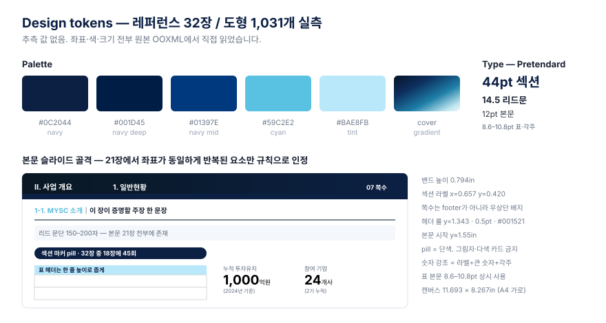
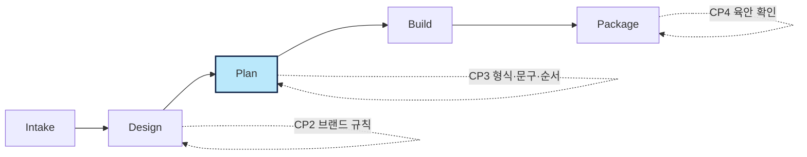

# MerryPPTmaker

**레퍼런스 덱에서 디자인 규칙을 실측해, 편집 가능한 네이티브 PowerPoint를 만드는 스킬.**

이미지로 찍어낸 슬라이드가 아닙니다. 표·도형·차트가 전부 PowerPoint 객체라 열어서 그대로 고칠 수 있습니다.

```bash
git clone https://github.com/merryAI-dev/MerryPPTmaker.git ~/.claude/skills/merry-slide
```

설치 후 Claude Code에 `제안서 만들어줘`라고 말하면 됩니다. 명령어를 외울 필요는 없습니다.

---

## 기술적으로 다른 점

**① 브랜드를 추측하지 않고 실측합니다**

레퍼런스 `.pptx`의 OOXML을 직접 파싱합니다. python-pptx가 노출하지 않는 `prstGeom`, 선 두께·점선·화살표, 그림자, 그룹 구조까지 읽습니다. 32장 / 도형 1,031개를 전수 스캔해도 추측 값은 0개입니다.

핵심 판별 규칙은 **"반복이 곧 브랜드 규칙"** 입니다. 2장 이상에서 같은 좌표에 나타난 요소만 규칙으로 인정하고, 한 장짜리 장식은 버립니다. 콘텐츠 영역 경계는 중앙값이 아니라 바깥 극값으로 잡습니다 — 중앙값은 작은 장식 도형에 끌려 안쪽으로 좁아지기 때문입니다. 하단 경계만 95백분위수를 써서 이상치를 흡수합니다.

슬라이드 **2~3장만으로도** 동작합니다. 3장 추출 결과와 32장 수동 분석 결과를 대조했을 때 유일한 차이는 콘텐츠 하단 0.13in이었습니다.

**② 미리보기와 결과물이 좌표를 공유합니다**

브라우저 미리보기와 PPTX 빌더가 `T.grid` 객체 **하나**를 함께 참조합니다. 좌표가 두 곳에 복제되지 않으므로 미리보기와 실제 결과가 어긋날 수 없습니다.

**③ 넘침을 렌더 전에 잡습니다**

한글 1.0 / 그 외 0.55 가중치로 시각 길이를 계산해 줄 수를 추정하고, 박스를 넘길 텍스트를 빌드 시점에 리포트합니다. 눈으로 보기 전에 걸립니다.

**④ 간트차트가 네이티브 차트입니다**

투명 오프셋 계열 + 실제 기간 계열을 쌓는 stacked bar 기법으로 만듭니다. 그림이 아니라 PowerPoint 차트 객체라 일정을 직접 수정할 수 있습니다.

**⑤ 이미지는 자르지 않습니다**

슬롯 크기에 맞춰 늘리고 줄일 뿐, 크롭도 레터박스도 없습니다. 동일 이미지는 `assets` 풀에 한 번만 저장하고 `assetId`로 참조합니다. 사진 243장 폴더에서 미리보기 HTML이 **124MB → 157KB**로 줄었습니다.

---

## 추출한 디자인 시스템

토큰은 문서가 아니라 **실행 가능한 코드**(`components/mysc-proposal.mjs`)로 옮겨져 있습니다.



---

## 파이프라인



CP3가 사람이 실제로 결정하는 지점입니다. 와이어프레임이 아니라 **실제 문구가 들어간 렌더**를 8개 형식으로 나란히 놓고 눈으로 비교해 고릅니다. `이 장 확정`을 누른 순서가 그대로 덱 순서가 되고, `PPTX 생성`을 누르면 그 자리에서 파일이 만들어집니다.

장표 형식: 표지 · 목차 · 간지 · 좌우 2단 · 표 중심 · 전폭 도식 · 숫자 강조 · 단계 흐름 · 차트

---

## 두 갈래 트랙

| | Native | Raster |
| --- | --- | --- |
| 출력 | 편집 가능한 PPTX 객체 | 이미지 슬라이드 |
| 쓰는 때 | 제안서·보고서 (기본값) | 자유 비주얼이 필요할 때 |

Stage 4에서만 갈라지고 그 앞 단계는 공유합니다.

---

## 리드 문단

MYSC 본문 슬라이드에는 150–200자 리드 문단이 항상 들어갑니다. 이를 위해 문장 **2,700건** 코퍼스와 규칙 기반 채점기를 로컬에 두고 있습니다 — 외부 API 호출은 없습니다. 모델이 이 자료를 참고해 그 자리에서 문장을 씁니다.

코퍼스는 기관명·지자체명·연락처를 전부 `{TARGET}` `{METHOD}` 같은 자리표시자로 치환한 상태입니다.

---

## 문서

실제 동작 기준은 이 파일이 아니라 아래 문서들입니다.

- [`SKILL.md`](SKILL.md) — 스테이지별 규칙과 체크포인트
- [`references/brand-extraction.md`](references/brand-extraction.md) — 브랜드 추출 계약
- [`references/composition-format.md`](references/composition-format.md) — 장표 형식과 콘텐츠 스키마
- [`references/lead-writing.md`](references/lead-writing.md) — 리드 문단 작성 기준
- [`references/design-quality-gate.md`](references/design-quality-gate.md) — 금지 패턴
- [`references/examples/mysc-2026/tokens.md`](references/examples/mysc-2026/tokens.md) — 실측 토큰 전량

---

## 아직 부족한 것

- 글의 품질은 사람 손이 필요합니다. 리드 문단이 길이를 못 채우면 일반적인 문장이 붙는데, 읽으면 티가 납니다. 초안 수준입니다.
- 브랜드 자동 추출은 MYSC 외 다른 브랜드로 실전 검증 전입니다.
- 사진이 많은 폴더는 `--serve`로 띄워야 합니다.
